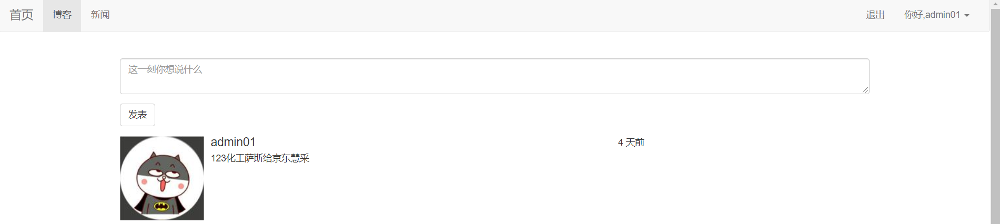

# 项目部署：

用户提交请求  ->nginx ->uwsgi ->python ->数据库  

这里用的是非常干净的`ubuntu 16.04`系统环境

## 在开发机上的准备工作：

1. 确认项目没有bug。

2. 用`pip freeze > requirements.txt`将当前环境的包导出到`requirements.txt`文件中，方便部署的时候安装。

3. 将项目上传到服务器上的`/srv`目录下。这里以`git`为例。使用`git`比其他上传方式（比如使用pycharm）更加的安全，因为`git`有版本管理的功能，以后如果想要回退到之前的版本，`git`轻而易举就可以做到。

4. 在`https://git-scm.com/downloads`下载`Windows`版本的客户端。然后双击一顿点击下一步安装即可。

5. 然后使用码云，在码云上创建一个项目。码云地址：<https://gitee.com/>

6. 然后进入到项目中，使用以下命令做代码提交：

   ```shell
    # 初始化一个仓库
    * git init 
    # 添加远程的仓库地址
    * git remote add origin xxx.git
    # 添加所有的代码到缓存区
    * git add .
    # 将代码提交到本地仓库
    * git commit -m 'first commit'
    # 从码云仓库上拉数据下来
    * git pull origin master --allow-unrelated-histories
    # 将本地仓库中的代码提交到远程服务器的master分支上
    * git push origin master
   ```

------

## 在服务器上的准备工作：

1. ubuntu开启root用户：

   ```
    > sudo passwd root
    > 然后输入root用户的密码
   ```

2. 为了方便`xshell`或者`CRT`连接服务器，建议安装`OpenSSH`（一般云服务器上都已经安装了）：

   ```shell
    sudo apt install openssh-server openssh-client
    service ssh restart
   ```

3. 安装`vim`：

   ```shell
    sudo apt install vim
   ```

4. 修改一下`ubuntu`的`apt`源（云服务器一般都有自己的源，可以不用修改），`apt`源是用来安装软件的链接：
   先拷贝`/etc/apt/sources.list`为`/etc/apt/sources.list.bak`，然后用`vi`编辑`/etc/apt/sources.list`，删除`sources.list`中的其他内容，将下面代码粘贴到文件中。然后保存：

   ```shell
   deb http://mirrors.ustc.edu.cn/ubuntu/ xenial main restricted universe multiverse
   deb http://mirrors.ustc.edu.cn/ubuntu/ xenial-security main restricted universe multiverse
   deb http://mirrors.ustc.edu.cn/ubuntu/ xenial-updates main restricted universe multiverse
   deb http://mirrors.ustc.edu.cn/ubuntu/ xenial-proposed main restricted universe multiverse
   deb http://mirrors.ustc.edu.cn/ubuntu/ xenial-backports main restricted universe multiverse
   deb-src http://mirrors.ustc.edu.cn/ubuntu/ xenial main restricted universe multiverse
   deb-src http://mirrors.ustc.edu.cn/ubuntu/ xenial-security main restricted universe multiverse
   deb-src http://mirrors.ustc.edu.cn/ubuntu/ xenial-updates main restricted universe multiverse
   deb-src http://mirrors.ustc.edu.cn/ubuntu/ xenial-proposed main restricted universe multiverse
   deb-src http://mirrors.ustc.edu.cn/ubuntu/ xenial-backports main restricted universe multiverse
   ```

   然后更新源：

   ```shell
    sudo apt update
   ```

5. 安装`MySQL`服务器和客户端：


   ```shell
    sudo apt install mysql-server mysql-client
   ```

6. 如果是sqlite 

   ```
   apt-get install sqlite sqlite3
   检查数据库安装结果：
   sqlite3
   .database
   .exit
   安装Sqlite3编译需要的工具包：
   apt-get install libsqlite3-dev
   ```

7. 安装`memcached`：
   通过命令`apt install memcached`即可安装。更多的`memcached`的知识点请参考`memcached`那一章节。

8. 安装好项目要用到的`Python`：

   ```
    * sudo apt install python3
    * sudo apt install python3-pip
    * pip install --upgrade pip
   ```

   如果系统上已经有`Python3`了，就无需再安装了。因为`supervisor`不支持`Python3`，所以还需要安装`Python2`，如果没有，就安装一下：

   ```
    * sudo apt install python2.7
    * sudo apt install python-pip
   ```

   然后输入`python2.7`即可使用了。
   如果在输入`pip`的时候提示以下错误：

   ```shell
    Traceback (most recent call last):
      File "/usr/bin/pip", line 9, in 
        from pip import main
    ImportError: cannot import name main
   ```

   这是因为`pip 10`的一个`bug`，可以零时使用以下解决方案：
   将`/usr/bin/pip`中的：

   ```python
    from pip import main 
    if __name__ == '__main__': 
        sys.exit(main())
   ```

   改成：

   ```
    from pip import __main__
    if __name__ == '__main__':
        sys.exit(__main__._main())
   ```

9. 安装`virtualenvwrapper`，并创建好项目要用到的虚拟环境：

   ```
    * pip install virtualenvwrapper
   ```

   安装完`virtualenvwrapper`后，还需要配置`virtualenvwrapper`的环境变量。

   - 首先通过`which virtualenvwrapper.sh`命令查看`virtualenvwrapper.sh`文件所在的路径。

   - 在当前用户目录下创建`.virtualenv`文件夹，用来存放所有的虚拟环境目录。

   - 在当前用户目录下编辑`.bashrc`文件，添加以下代码：

     ```shell
     #if [ -f ~/.bash_aliases ]; then  这里可以给它注释掉
     #    . ~/.bash_aliases
     #fi
     
     # enable programmable completion features (you don't need to enable
     # this, if it's already enabled in /etc/bash.bashrc and /etc/profile
     # sources /etc/bash.bashrc).
     #if [ -f /etc/bash_completion ] && ! shopt -oq posix; then
     #    . /etc/bash_completion
     #fi
     
     
     if [ -f /usr/local/bin/virtualenvwrapper.sh ]; then
         export WORKON_HOME=$HOME/.virtualenvs
         export VIRTUALENVWRAPPER_PYTHON=/usr/bin/python3.5
         export VIRTUALENVWRAPPER_VIRTUALENV=/usr/local/bin/virtualenv
         source /usr/local/bin/virtualenvwrapper.sh
     
     fi
     
     ```

     然后退出`bashrc`文件，输入命令`source ~/.bashrc`。

     注意：因为我们是把`virtualenvwrapper`安装在了`python2`的环境中，所以在创建虚拟环境的时候需要使用`--python`参数指定使用哪个`Python`文件。比如我的`python3`的路径是在`/usr/bin/python3`。那么示例代码如下：

     ```shell
     mkvirtualenv --python=/usr/bin/python3 xfz-env
     ```

10. 安装`git`：

    ```shell
     sudo apt install git
    ```

11. 使用`git`下载项目代码：

    ```shell
    * git init
    * git remote add origin https://gitee.com/**/**
    * git pull origin master
    ```

12. 进入虚拟环境中，然后进入到项目所在的目录，执行命令：`pip install -r requirements.txt`，安装项目依赖的包。如果提示`OSError: mysql_config not found`，那么再安装`sudo apt install libmysqld-dev`即可。

13. 进入`mysql`数据库中，创建好项目的数据库。

14. 执行`python manage.py migrate/upgrade`将模型映射到数据库中。

15. 执行`python kangbazi.py`，然后在自己电脑上访问这个网站，确保没有BUG。

16. 设置`DEBUG=False`，避免如果你的网站产生错误，而将错误信息暴漏给用户。

------

## 安装uwsgi：

uwsgi是一个应用服务器，非静态文件的网络请求就必须通过他完成，他也可以充当静态文件服务器，但不是他的强项。uwsgi是使用python编写的，因此通过`pip3 install uwsgi`就可以了。(uwsgi必须安装在系统级别的Python环境中，不要安装到虚拟环境中)。然后创建一个叫做`uwsgi.ini`的配置文件：

```shell
[uwsgi]

# 必须全部为绝对路径
# 项目的路径
chdir           = /blog/
# flask 入口文件 
wsgi-file       = /blog/manage.py
# 回调的app对象
callable        = app
# Python虚拟环境的路径
home            = /root/.virtualenvs/ligong-env

# 进程相关的设置
# 主进程
master          = true
# 最大数量的工作进程
processes       = 10

http            = :8000   在没有安装nginx 的情况下  选择这个 
socket          = /blog/blog.sock 安装上了 nginx  选择这个 跟nginx配置文件中的kangbazi 下面的是一样的   

# 设置socket的权限
chmod-socket    = 666
# 退出的时候是否清理环境
vacuum          = true
```

然后通过命令`uwsgi --ini uwsgi.ini`运行，确保没有错误。然后在浏览器中访问`http://ip地址:8000`，如果能够访问到页面（可能没有静态文件）说明`uwsgi`配置没有问题。

## 安装和配置nginx：

虽然`uwsgi`可以正常的部署我们的项目了。但我们还是依然要采用`nginx`来作为**web服务器**。使用`nginx`来作为web服务器有以下好处：

1. uwsgi对静态文件资源处理并不好，包括响应速度，缓存等。
2. nginx作为专业的web服务器，暴露在公网上会比uwsgi更加安全一点。
3. 运维起来更加方便。比如要将某些IP写入黑名单，nginx可以非常方便的写进去。而uwsgi可能还要写一大段代码才能实现。

### 安装：

通过`apt install nginx`即可安装。

### nginx简单操作命令：

- 启动：service nginx start
- 关闭：service nginx stop
- 重启：service nginx restart
- 测试配置文件：service nginx configtest

### 添加配置文件：

在`/etc/nginx/conf.d`目录下，新建一个文件，叫做`blog.conf`，然后将以下代码粘贴进去：

```conf
upstream kangbazi{
    server unix:///blog/blog.sock; 
}

# 配置服务器
server {
    # 监听的端口号
    listen      80;
    # 域名 你的服务器的
    server_name 192.168.0.101;  
    charset     utf-8;

    # 最大的文件上传尺寸
    client_max_body_size 75M;  

    # 静态文件访问的url
    location /static {
        # 静态文件地址
        alias /blog/app/static； 
    }

    # 最后，发送所有非静态文件请求到django服务器
    location / {
        uwsgi_pass  kangbazi;
        # uwsgi_params文件地址
        include     /etc/nginx/uwsgi_params; 
    }
}
```

写完配置文件后，为了测试配置文件是否设置成功，运行命令：`service nginx configtest`，如果不报错，说明成功。
每次修改完了配置文件，都要记得运行`service nginx restart`。

------

## 使用supervisor管理`uwsgi`进程：

让supervisor管理uwsgi，可以在uwsgi发生意外的情况下，会自动的重启。

### 安装supervisor：

因为`supervisor`是用`python`写成的，所以通过`pip`即可安装。
并且因为`supervisor`不支持`python3`，因此需要把`supervisor`安装在`python2`的环境中。
`pip2 install supervisor`。

### 启动：

在项目的根目录下创建一个文件叫做`supervisor.conf`，然后将以下代码填入到配置文件中：

```conf
    # supervisor的程序名字
    [program:blog]
    # supervisor执行的命令
    command=uwsgi --ini uwsgi.ini
    # 项目的目录
    directory = /blog
    # 开始的时候等待多少秒
    startsecs=0
    # 停止的时候等待多少秒
    stopwaitsecs=0  
    # 自动开始
    autostart=true
    # 程序挂了后自动重启
    autorestart=true
    # 输出的log文件
    stdout_logfile=/var/log/supervisord.log
    # 输出的错误文件
    stderr_logfile=/var/log/supervisord.err

    [supervisord]
    # log的级别
    loglevel=debug

    [inet_http_server]
    # supervisor的服务器
    port = 127.0.0.1:9001
    # 用户名和密码
    username = admin
    password = 123

    # 使用supervisorctl的配置
    [supervisorctl]
    # 使用supervisorctl登录的地址和端口号
    serverurl = http://127.0.0.1:9001

    # 登录supervisorctl的用户名和密码
    username = admin
    password = 123

    [rpcinterface:supervisor]
    supervisor.rpcinterface_factory = supervisor.rpcinterface:make_main_rpcinterface
```

然后使用命令`supervisord -c supervisor.conf`运行就可以了。
以后如果想要启动`uwsgi`，就可以通过命令`supervisorctl -c supervisor.conf`进入到管理控制台，然后可以执行相关的命令进行管理：

- status # 查看状态
- start program_name #启动程序
- restart program_name #重新启动程序
- stop program_name # 关闭程序
- reload # 重新加载配置文件
- quit # 退出控制台

